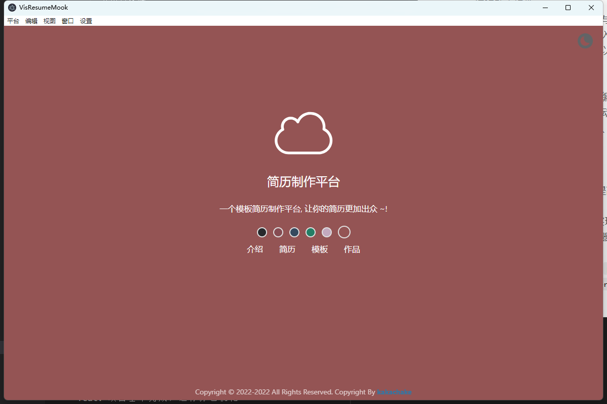
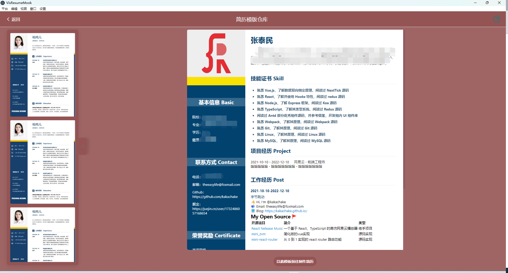
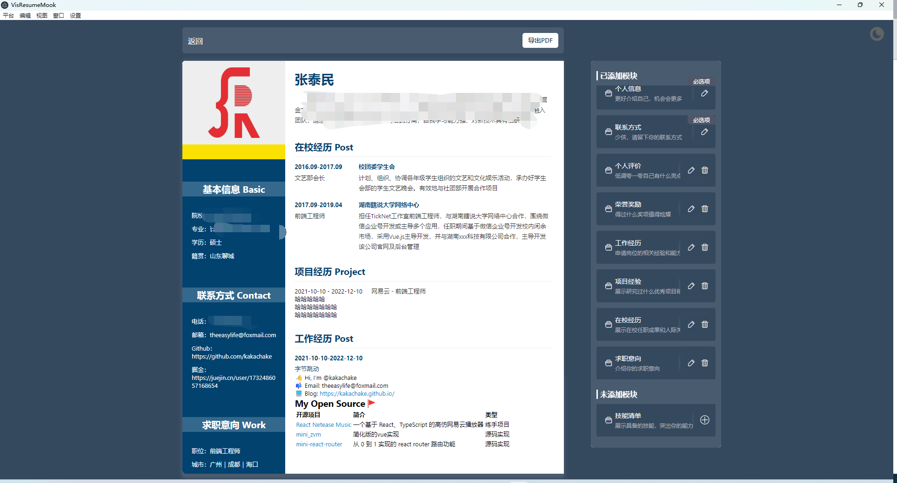

# Electron + React + Typescript 简历平台

ResumeMook——一个基于 React、TypeScript、Electron 的简历制作软件

## 基础功能

- 首页
- 数据录入
- 简历展示
- 模板选择
- 简历导出

## 特色功能

- 暗黑模式
- 主题换肤
- 组件化
- 远程模板

## 项目特点

- 自定义组件
  自定义了`ReButton`、`ReInput`、`ReModal`、`ReTheme`、`ReForm`、`ReFormRender`等组件：
  - 远程动态组件
    使用远程动态组件分割主项目与模板项目，开发者可自己创建简历模板，通过远程加载的方式引入模板文件，方便快捷。Webpack 5 新增的 Module Federation 可以实现这个需求，不过本项目使用的为另一种方案。
  - FormRender 组件
    由于项目中存在众多表单，故编写 FormRender 组件，其作用为解析 schema 表单配置文件，自动生成表单，配合 Form 组件，可实现表单的基础信息收集、验证、嵌套等功能。
- 自定义 hooks
  定义多个公共 hooks
- 打包优化
  - 使用 `cache` 缓存编译结果，提高打包速度
  - 使用 `code split` 做代码分割，减少首屏加载量，提高首屏渲染速度
  - 使用组件懒加载`import()`来实现按需加载，动态导入模块
  - 使用预加载`preload`来在浏览器空闲时间预加载模块文件，提升用户体验
  - 使用 `corejs` 按需引入，提供 `polyfill`
  - 使用`CssMinimizerPlugin`、`TerserWebpackPlugin`压缩 css、js 代码

## 预览

